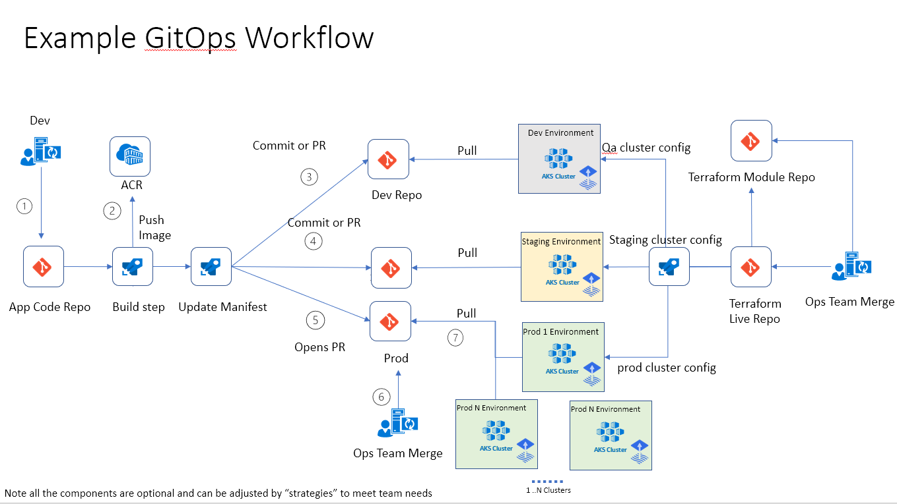

# Barque (GitOps Deployer)

[Barque](https://en.wikipedia.org/wiki/Barque)[*](#naming) enables standing up K8s and GitOps infrastructure in a fast repeatable way with flexibility on enable different types of workflows, manifest configurations, tools and cluster deployments.

## Getting started
Get started by creating an [Azure DevOps organization](https://docs.microsoft.com/en-us/azure/devops/organizations/accounts/create-organization?view=azure-devops#create-an-organization), adding an [ssh key](https://docs.microsoft.com/en-us/azure/devops/repos/git/use-ssh-keys-to-authenticate?view=azure-devops&tabs=current-page) and running the following.  

Watch a [barque of the workflows in action](docs/imgs/gitops-barque-demo.mp4).

```bash
./setup.sh --org <AzDo-OrgName> -acr <existing-acr-name>
```

This will provision the following infrastructure for deploying an app:



Infra Deployed:
- Azure Project
  - Azure Git Repos:
    - application
    - terraform-modules
    - terraform-live
    - manifest-live
  - Azure Pipelines
    - App PR Triggered
    - App Release Triggered
    - terraform-module-release
    - terraform-infra-live-release
- Azure AKS clusters
  - Dev
  - Staging
  - QA

Example Workflow:

1. Dev checks in code
2. Security checks, linting, build push to ACR (automated)
3. Update Dev manifests with image id from ACR - Deployed automatically to dev via flex pull (automated)
4. Update Staging manifests with image id from ACR - Deployed automatically to staging via flux pull (automated)
5. Open PR against production manifests with image id (automated)
6. Operator merges PR when ready to move to production
7. Prod cluster pulls updates to cluster

> note this is a prototype and the script to deploy may change or a different mechanism might be used but concepts and ease of use will remain.  Please open an issue to share thoughts and ways to improve.

## Running `setup.sh`

```bash
./setup.sh --org <AzDo-OrgName> -acr <existing-acr-name>
```

### Parameters

- `--org` is an existing Azure DevOps Organization. **Required**.
- `-acr` or `--acr-name` is an existing [Azure Container Registry](https://docs.microsoft.com/en-us/azure/container-registry/container-registry-get-started-portal#create-a-container-registry). **Required**.
- `-w` or `--workflow-strategy` is a workflow strategy in the [workflow-strategies directory](https://dev.azure.com/jstur/_git/gitops?path=/pipelines/workflow-strategies). You can use an existing one or [add your own strategy](#add-your-own-strategy). Defaults to `release-flow`. Optional.
- `-p` or `--project-name` is the name of the Azure DevOps Project within the org. If the project does not exist, it will be created. Defaults to `gitops-test`. Optional.
- `-r` or `--repo-app-name` is the name of the application repository in Azure DevOps. If the repository does not exist, it will be created. Defaults to `app`. Optional.
- `-a` or `--app-repo` is the local filepath or the url of the application repository. Defaults to [Azure Voting App repository](https://github.com/Azure-Samples/azure-voting-app-redis.git). Optional.
- `-tp` or `--trigger-pipelines` determines whether this script runs the pipelines after creation. Defaults to `false`. Optional.

## Motivation
Most demos and articles only demonstrate how the "Pull Request" flow of GitOps to deploy to production and leaves how you to [figure out the rest of the story](https://cloud.google.com/solutions/addressing-continuous-delivery-challenges-in-a-kubernetes-world#questions_raised_by_gitops).  The "rest of the story" ends up being a [complex set of options](https://github.com/fluxcd/flux/issues/1071) that are dependent on each teams workflows, processes, and team structures.  

Additionally, there are many moving parts (build pipelines, multiple repositories, infrastructure) required to set up a workflow and manifest repository in order to evaluate the complex set of options gitops.  When a team is evaluating GitOps it is often useful to see an end to end solution quickly to get a sense of the flows required and make a decision on how to approach the final solution.  

## Strategies
Not every customer or team is going to have the same set of requirements or needs.  To that end Barque does not care what tooling you use under the hood it simply is the orchestrator for wiring all the components together.

To that end, Barque can be provided *Strategies" which enable different types of workflows, Manifest configurations, tools and cluster deployments.

### Workflow Strategies
Multiple pipeline workflows can be supported:

- [PR strategies](/pipelines/workflow-strategies/release-flow)
- [Ring based strategies](/pipelines/workflow-strategies/ring-flow)
- [Helm Operator](https://github.com/fluxcd/helm-operator) (not implemented)
- [Progressive delivery with flagger](https://docs.flagger.app/) (not implemented)

Many more are possible...

#### Manifest Strategies
The can be support for multiple tools and strategies as well as combinations of them.

- [Kustomize](https://kubectl.docs.kubernetes.io/pages/app_composition_and_deployment/structure_introduction.html)
  - Directory per env 
  - branch per env (not implemented)
  - Repository per env (not implemented)

### Cluster Deployment Strategies

Not only should you be able to set up workflows but you need a strategy for deploying your clusters.  To stratgies that are in progress are:

- [Azure Cluster Api](https://github.com/kubernetes-sigs/cluster-api-provider-azure) 
- [Terraform](https://github.com/jsturtevant/barque/issues/1)

## Add your own Strategy
Docs on how this works will be completed later after idea is flushed out more.

1. git clone 
1. mkdir ./workflow-strategies/$NEW_STRATEGY_NAME
1. mkdir ./workflow-strategies/$NEW_STRATEGY_NAME/pipelines
1. Add your templates to the folder.  These templates will be copied into a `.azuredevops/templates` folder
1. mkdir ./workflow-strategies/$NEW_STRATEGY_NAME/manifest
1. Add main pipelines to this folder.  These will be copied to `.azuredevops` folder.  They will not be override later.  The user should modify these to add there custom solutions.  Reference the tempaltes in `.azuredevops/tempaltes` folder.
1. 1. mkdir ./workflow-strategies/$NEW_STRATEGY_NAME/pipelines/scripts
1. Add custom scripts to this folder to set up pipeline variables, etc.

## RoadMap
See https://github.com/jsturtevant/barque/issues.

## Dev
Azure Cli
- https://github.com/Azure/azure-cli-dev-tools
- https://github.com/Azure/azure-cli/blob/master/doc/extensions/authoring.md

## FAQ

### Pipeline build fails at ACR with permission error
First run of the pipeline give ACR error, is typically a caching error in Azure. Waiting a 5-10 mins resolves the issue.  Atlernatively could use a Service Connection with a preset Service Principal.

```
##[error]Error Code: [1]
##[error]Error: Azure login failed
##[error]Script failed with error: Get Token request returned http error: 400 and server response: {"error":"unauthorized_client","error_description":"AADSTS700016: Application with identifier '***' was not found in the directory '***'. This can happen if the application has not been installed by the administrator of the tenant or consented to by any user in the tenant. You may have sent your authentication request to the wrong tenant.\r\nTrace ID: db7ef84c-4e7c-4\r\nCorrelation ID: c2eb30-99fe-4a8b315\r\nTimestamp: 2020-05-13 23:33:54Z","error_codes":[700016],"timestamp":"2020-05-13 23:33:54Z","trace_id":"db7ef84c-4bd2-a46e-680fc5482700","correlation_id":"c26a-31c304e315","error_uri":"https://login.microsoftonline.com/error?code=700016"
```

## Inspired by
Inspired by the work at https://github.com/Microsoft/bedrock/

### naming
* because every project needs a cool name